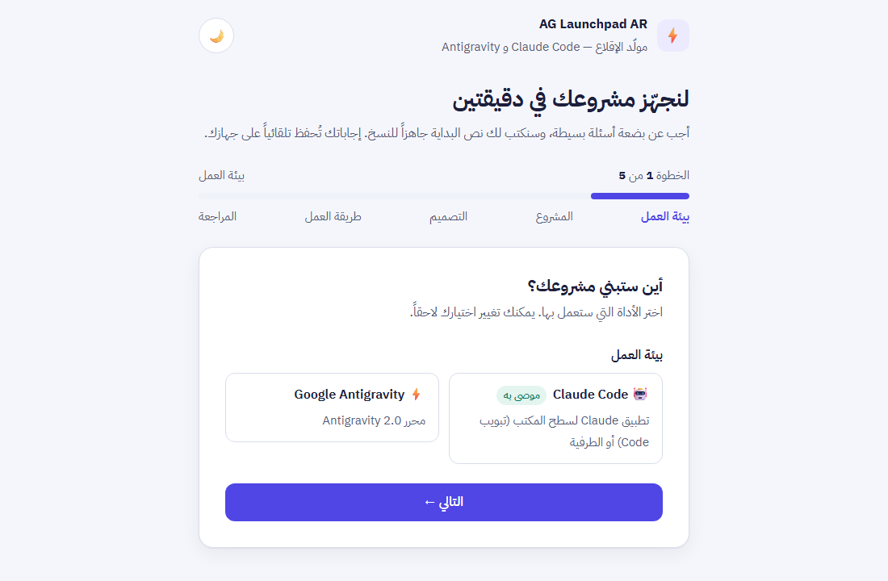
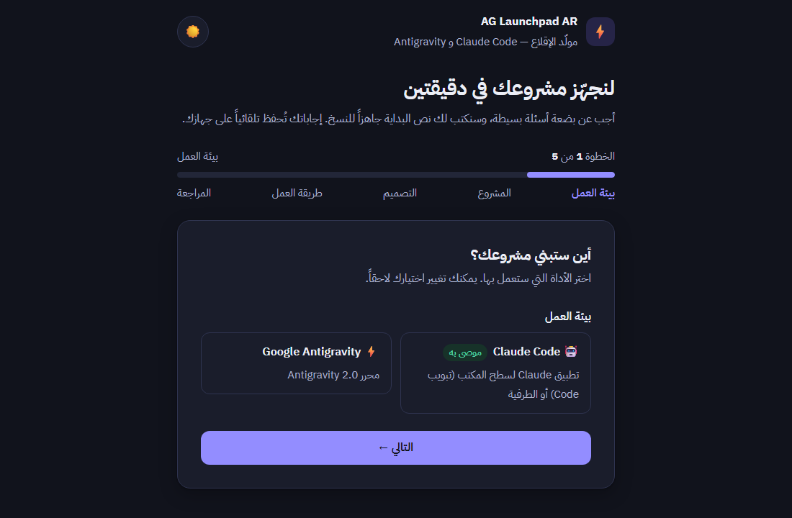

<div dir="rtl">

<p align="center">
  
  
  
  
  
  
</p>

<h1 align="center">⚡ AG Launchpad AR</h1>

<p align="center">
  <strong>منصة إقلاع عربية للمشاريع البرمجية — لـ Claude Code و Google Antigravity 2.0</strong>
</p>

<p align="center">
  ابدأ أي مشروع برمجي جديد بنظام قواعد حاكم، خريطة مشروع جاهزة، ونظام تتبع مدمج —<br>
  حتى لو ما عندك خبرة برمجية سابقة.
</p>

---

## 🤔 ما هو AG Launchpad؟

&rlm;**AG Launchpad AR** هو قالب إقلاع عربي جاهز (Starter Template) تضعه في مجلد مشروعك قبل ما تبدأ، فيتحوّل وكيل الذكاء الاصطناعي من مساعد عشوائي إلى **مهندس برمجيات منضبط** يلتزم بـ 37 بنداً حاكماً تغطي:

- 🔒 **الأمن السيبراني** — حماية المفاتيح، منع الحقن النصي، قواعد أمان Firebase
- 📐 **جودة الكود** — سقف حجم الملفات، اختبارات وفحص آلي من اليوم الأول، معايير حديثة
- 🔥 **معيار تقني موحّد** — Firebase (مصادقة، قاعدة بيانات، قواعد أمان مختبرة على المحاكي) مع 4 مخططات جاهزة: ويب، Flutter،&rlm; React Native، باك إند
- 🔄 **سير العمل** — شبكة إجماع، عصف ذهني، فحص بيئي تلقائي
- 🎨 **الواجهات** — تصميم متجاوب، وصولية WCAG 2.1،&rlm; i18n عالمي
- 📊 **التوثيق التلقائي** — سجلات التغييرات والأخطاء والقرارات التقنية

**🔀 دعم مزدوج:** ملفات القواعد نفسها تعمل في بيئتين، ولكل بيئة مدخلها الخاص:

| البيئة | ملف المدخل | ما يضيفه |
|:-------|:-----------|:---------|
| **Claude Code** | `CLAUDE.md` + مجلد `.claude/` | Hooks تنفّذ القواعد آلياً، 3 وكلاء مراجعة مستقلون، 15 أمراً جاهزاً، وضع التعلّم، اقتراحات تطوير بعد كل مهمة، سطر حالة في الطرفية |
| **Google Antigravity 2.0** | `.agents/AGENTS.md` | يعمل كما هو دون أي تغيير، ويستفيد من المخططات التقنية الجاهزة وقاموس المصطلحات |

> 🌍 **لماذا عربي؟** لأن جميع القواعد والتوجيهات والتواصل مع الوكيل مكتوبة بالعربية الفصحى المباشرة. القالب مصمم لخدمة مجتمع الـ Vibe Coders العرب الذين يبنون مشاريعهم باستخدام الذكاء الاصطناعي.

---

## ⚡ ابدأ في 3 خطوات

| # | الخطوة | كيف |
|:-:|:-------|:----|
| 1 | **حمّل القالب** | اضغط **Code ←&rlm; Download ZIP** أعلى هذه الصفحة وفك الضغط، ثم سمِّ المجلد باسم مشروعك بالإنجليزية (أو استخدم `git clone` — [التفاصيل](#how-to-start)) |
| 2 | **افتحه في Claude** | تطبيق Claude لسطح المكتب ← تبويب **Code** ← اختر مجلد المشروع نفسه ← وافق على «الثقة بالمجلد» |
| 3 | **اكتب: السلام عليكم** | يعرض عليك Claude فتح مولّد الإقلاع أو طرح الأسئلة في المحادثة، ثم يقودك خطوة بخطوة حتى الإطلاق |

<p align="center">
  
  
</p>
<p align="center"><sub>🧙 مولّد الإقلاع: معالج من 5 خطوات بوضعين فاتح وداكن، مع مراجعة قبل التوليد وحفظ تلقائي — يعمل على جهازك دون إرسال أي بيانات</sub></p>

> 📋 **المتطلبات:** اشتراك Claude مدفوع، و Node.js 18+، وعلى ويندوز Git for Windows — [التفاصيل](#requirements). تستخدم Google Antigravity؟ [مسارها هنا](#antigravity-start).

---

<a id="beginner-journey"></a>

## 🎯 مصمم لنجاح المبتدئ

الهدف أن تبني تطبيقاً قوياً من اليوم الأول دون خبرة سابقة. يقودك القالب في رحلة من 8 محطات، فتتجنب القرارات الخاطئة المبكرة، وتعرف خطوتك التالية دائماً، وتتعلم أثناء البناء.

| # | المحطة | الأمر | ماذا تحصل عليه |
|:-:|:-------|:------|:---------------|
| 1 | **الإقلاع** | `/kickoff` | تسجيل فكرتك ومستوى خبرتك، فحص جهازك، وتجهيز خريطة المشروع |
| 2 | **العصف الذهني** | `/grill-me` | أسئلة اختيار من متعدد تحوّل فكرتك إلى نطاق MVP واضح قبل أي كود |
| 3 | **المخطط الجاهز** | `/blueprint` | حزمة تقنية مجرّبة لنوع مشروعك (ويب / Flutter /&rlm; React Native / باك إند) بدل الاختيار العشوائي |
| 4 | **أساس الجودة** | `/quality-setup` | تنسيق الكود وفحصه، أول اختبار حقيقي، وفحص آلي (CI) مع كل رفع — من اليوم الأول |
| 5 | **البناء بخطوات واضحة** | `/next` | مهمة واحدة واضحة بمعايير قبول، وبعد كل مهمة 3 اقتراحات تطوير تختار منها بنقرة (على طريقة Lovable) |
| 6 | **الفهم** | وضع التعلّم + `/explain` | شرح مبسّط لكل قرار مهم، وشرح كل مصطلح عند أول ظهور وحفظه في قاموس `docs/glossary.md` |
| 7 | **الإصلاح** | `/fix` | تتبّع هادئ للسبب الجذري، اختبار يمنع عودة الخطأ، وتوقف آمن بعد عدد محدود من المحاولات |
| 8 | **الإطلاق الآمن** | `/launch-check` | فحص شامل قبل الإطلاق: الأمن، الأداء، الوصولية، النشر — وأي ❌ أمني يوقف الإطلاق |

> 💡 **لا تعرف ماذا تفعل الآن؟** اكتب `/next` في أي لحظة.

### 💡 اقتراحات التطوير بعد كل مهمة

بعد كل مهمة تغيّر المشروع وتُوثَّق، يسألك الوكيل **"ماذا نطوّر الآن؟"** بثلاثة خيارات، ويمكنك كتابة طلب آخر بحرية:

| الخيار | ما يقترحه |
|:-------|:----------|
| ✨ ميزة | المهمة التالية من المرحلة النشطة في خطة الـ MVP |
| 🛡️ جودة وأمان | تحسين أمني أو أدائي أو اختبارات لما بُني للتو |
| 🎨 تجربة مستخدم | تحسين يلمسه المستخدم النهائي فيما بُني للتو |

* لا يقترح الوكيل ميزات خارج نطاق الـ MVP قبل اكتماله؛ تُحفظ هذه الأفكار في قسم **أفكار التطوير المستقبلية (Backlog)** في `project_map.md`.
* لإيقاف الاقتراحات: اطلب ذلك من الوكيل، أو غيّر قيمة `اقتراحات التطوير` في `project_map.md` إلى `معطّلة`.

### 🎓 وضع التعلّم

يسألك `/kickoff` عن مستوى خبرتك ويضبط وضع التعلّم تبعاً له:

| مستوى الخبرة | يناسبك إذا | وضع التعلّم |
|:-------------|:-----------|:------------|
| مبتدئ تماماً | لم تكتب كوداً من قبل | مفعّل |
| لدي أساسيات | جرّبت كوداً بسيطاً (دورة أو درس) ولم تبنِ تطبيقاً كاملاً بعد | مفعّل |
| مطوّر | بنيت تطبيقات من قبل وتفضّل ردوداً مختصرة | معطّل |

إن ترددت فاختر «مبتدئ تماماً».

عند تفعيله يضيف الوكيل بعد كل قرار أو تعديل مهم كتلة `🎓 تعلّم:` من سطرين أو ثلاثة: ماذا فعلنا، ولماذا، وماذا كان سيحدث لو لم نفعله. لتغييره اطلب ذلك من الوكيل، أو عدّل قيمة `وضع التعلّم` في `project_map.md`.

### 🔀 ما الذي يعمل في كل بيئة؟

| الميزة | Claude Code | Antigravity 2.0 |
|:-------|:-----------:|:---------------:|
| القواعد الحاكمة (37 بنداً) | ✅ | ✅ |
| المخططات التقنية `blueprints/` | ✅ عبر `/blueprint` | ✅ يقرؤها الوكيل أثناء العصف الذهني |
| قاموس المصطلحات `docs/glossary.md` | ✅ يُحدَّث آلياً | ✅ ملف مقروء، ويحدّثه الوكيل بطلبك |
| المهارات الـ 15 (`/next`،&rlm; `/fix` ...) | ✅ | ⚠️ `/grill-me` فقط؛ بقية الإجراءات بطلبها من الوكيل |
| وضع التعلّم + الاقتراحات بعد كل مهمة | ✅ بخيارات قابلة للنقر، ويذكّر بها Hook كل جلسة | ⚠️ اقتراحات مرقّمة نصاً عبر تعليمات `.agents/AGENTS.md` (دون تذكير آلي) |
| الـ Hooks (الإنفاذ الآلي والتذكيرات) | ✅ | ❌ |
| سطر الحالة | ✅ في الطرفية (CLI) | ❌ |

---

## 🧭 أي بيئة أختار؟

| المعيار | Claude Code | Google Antigravity 2.0 |
|:--------|:------------|:-----------------------|
| **الاشتراك** | خطة Claude مدفوعة (Pro / Max / Team / Enterprise) | حساب Google Antigravity |
| **الواجهة للمبتدئ** | تطبيق Claude لسطح المكتب (تبويب Code) أو الطرفية | محرر Antigravity |
| **فرض القواعد** | آلي: Hooks تمنع وتنبّه قبل وقوع المخالفة | التزام الوكيل بما قرأه |
| **شبكة الإجماع** | 3 وكلاء فرعيون مستقلون يعملون بالتوازي | الوكيل يتقمّص 3 شخصيات |
| **عرض العربية في المحادثة** | بلا دعم RTL أصلي (انظر [حدود معروفة](#known-limits)) | تُغلَّف الردود بـ `<div dir="rtl">` |
| **العزل (Sandbox)** | فرع Git مؤقت (+ `/sandbox` على macOS/Linux/WSL فقط) | Sandbox مدمج |
| **رحلة المبتدئ الموجّهة** | كاملة: 15 أمراً، وضع التعلّم، اقتراحات بعد كل مهمة | المخططات التقنية والقواعد، والخطوات بطلبها من الوكيل |

> 💡 **الخلاصة:** إذا كنت تستخدم Antigravity أصلاً فاستمر عليه. إذا أردت إنفاذاً آلياً للقواعد ومراجعة مستقلة حقيقية ورحلة مبتدئ موجّهة بالكامل فاختر Claude Code.

---

<a id="how-to-start"></a>

## 🚀 كيف تبدأ؟

### الخطوة المشتركة: حمّل القالب
استبدل الكلمة المحجوزة `<your-project-name>` في كلا الأمرين أدناه باسم مشروعك الجديد باللغة الإنجليزية:
```bash
git clone https://github.com/bmubook/ag-launchpad-ar.git <your-project-name>
cd <your-project-name>
```
> 💡 **تنبيه:** تأكد من استبدال الكلمة المحجوزة `<your-project-name>` في كلا الأمرين بنفس الاسم الذي اخترته لمشروعك لتتمكن من إنشاء مجلد المشروع والدخول إليه بنجاح.
>
> 📦 **بدون أوامر؟** من أعلى صفحة المستودع على GitHub اضغط **Code ←&rlm; Download ZIP**، ثم فك الضغط وسمِّ المجلد باسم مشروعك بالإنجليزية. سيعرض عليك الوكيل تهيئة Git أثناء الإقلاع.

### 🟠 البدء السريع — Claude Code (تطبيق سطح المكتب — مستحسن للمبتدئ)
1. ثبّت **تطبيق Claude لسطح المكتب** من [claude.ai/download](https://claude.ai/download) وسجّل الدخول بحساب خطة مدفوعة.
2. افتح تبويب **Code**.
3. اختر مجلد المشروع **الجذري** (المجلد الذي يحوي `CLAUDE.md`) — ليس مجلداً فرعياً داخله.
4. وافق على نافذة **الثقة بالمجلد (Trust)**. مجلد `.claude/hooks/` يحوي سكربتات Node صغيرة مقروءة تفرض القواعد، ويمكنك فتحها وقراءتها قبل الموافقة.
5. افتح ملف **`SETUP_GUIDE.html`** بالنقر المزدوج (أو اكتب لـ Claude: «افتح لي مولّد الإقلاع»)، واختر **Claude Code**، ثم أجب عن أسئلة المعالج خطوة بخطوة واضغط **«توليد نص البداية»** ⚡
6. انسخ الناتج (يبدأ بـ `/kickoff`) والصقه في محادثة Claude Code 🎉
7. بعد الإقلاع اتبع [رحلة المبتدئ](#beginner-journey)، واكتب `/next` كلما احترت في الخطوة التالية.

**البديل عبر الطرفية (CLI):** على ويندوز، شغّل في PowerShell:
```powershell
irm https://claude.ai/install.ps1 | iex
```
ثم من داخل المجلد الجذري للمشروع شغّل:
```bash
claude
```
> 🍎 على macOS/Linux اتبع دليل التثبيت الرسمي في [code.claude.com/docs](https://code.claude.com/docs).

<a id="antigravity-start"></a>

### 🟣 البدء السريع — Google Antigravity 2.0
1. افتح المجلد في **Google Antigravity 2.0**
2. افتح ملف **`SETUP_GUIDE.html`** بالنقر المزدوج واختر **Google Antigravity**
3. أجب عن أسئلة المعالج خطوة بخطوة واضغط **«توليد نص البداية»** ⚡
4. انسخ البرومبت والصقه في شات الوكيل
5. الوكيل يتولى الباقي تلقائياً! 🎉

### الطريقة اليدوية (للبيئتين):
1. افتح `SETUP_GUIDE.md` وانسخ النص الخاص ببيئتك
2. استبدل الأقواس `[...]` بمعلوماتك
3. أرسله للوكيل

---

## ⌨️ أوامر Claude Code (15 مهارة)

تكتب الأمر في صندوق المحادثة، ويمكنك إضافة نص بعده (مثال: `/grill-me ميزة الدفع` أو `/explain قواعد الأمان`).

### 🧭 أوامر الرحلة (بالترتيب)

| الأمر | متى تستخدمه | ماذا يفعل |
|:------|:------------|:----------|
| `/kickoff` | أول مرة فقط | يقلع المشروع: يسجّل بياناتك ويسألك عن مستوى خبرتك، يشغّل الفحص البيئي، يملأ `project_map.md`، ثم يبدأ العصف الذهني |
| `/grill-me` | فكرة غامضة أو ميزة جديدة | عصف ذهني بأسئلة اختيار من متعدد — سؤالان كحد أقصى في كل مرة (البندان 9 و27) — وبعد إعلانك انتهاءه يقترح المخطط التقني (`/blueprint`)، ثم يجهّز أساس الجودة (`/quality-setup`) بعد اعتماد التقنيات |
| `/blueprint` | عند اختيار التقنيات (يستدعيه `/grill-me`) | يلخّص المخطط المطابق من `blueprints/` (`web` أو `flutter` أو `react-native` أو `backend`)، ويقارنه باحتياجات فكرتك، وعند موافقتك يملأ التقنيات والمجلدات والمراحل في `project_map.md` ويسجّل القرار في `decisions_log.md` |
| `/quality-setup` | بعد اعتماد التقنيات مباشرة | يجهّز المنسّق (Formatter) والفاحص (Linter) ومشغّل الاختبارات مع أول اختبار حقيقي، وسكربتات `lint` و`test` و`build` و`check`، وملفَي `ci.yml` و`dependabot.yml`، ويتحقق أنها تعمل محلياً (البند 19) |
| `/next` | كلما سألت نفسك "ماذا أفعل الآن؟" | يختار المهمة التالية بالأولوية: الأخطاء الحرجة ← مهام المرحلة النشطة ← نواقص الجودة ← المرحلة التالية ← أفكار Backlog، ويعرضها بطاقة: لماذا الآن، معايير القبول، الملفات المتوقعة، الحجم |
| `/explain` | مصطلح أو ملف أو رسالة خطأ لم تفهمها | شرح بعربية بسيطة مع تشبيه من الحياة اليومية، ثم "كيف يظهر هذا في مشروعك" بالإشارة إلى ملفاتك، ويضيف المصطلح الجديد إلى `docs/glossary.md` |
| `/fix` | ظهر خطأ أو سلوك غير متوقع | إصلاح موجّه: يجمع العَرَض ويعيد إنتاجه، يتتبّع السبب الجذري (البند 22)، يعمل على فرع `fix/...`، يكتب اختباراً يمنع عودة الخطأ، ويتوقف بعد 3 محاولات (5 في `prototype`) ليقترح الترجيع (البند 8) |
| `/launch-check` | قبل الإطلاق للمستخدمين | فحص شامل يُحفظ في `docs/launch-report.md`: الاختبارات والبناء، الأمن (قواعد الأمان، الأسرار، الصلاحيات، App Check)، الأداء، الوصولية، RTL، ومتطلبات النشر. أي ❌ أمني يوقف الإطلاق (البند 0) |

### 🧰 أوامر مساندة

| الأمر | متى تستخدمه | ماذا يفعل |
|:------|:------------|:----------|
| `/env-audit` | بعد الإقلاع أو عند تغيير الجهاز | الفحص البيئي (البند 10) وتسجيل النتائج في `project_map.md` |
| `/consensus-gate` | قبل اعتماد تعديل مهم | يشغّل 3 وكلاء مراجعة مستقلين بالتوازي: الأمن، الأداء، تجربة المستخدم (البند 7) |
| `/document` | بعد كل تعديل ناجح | التوثيق الإلزامي في السجلات الأربعة + ختم التوثيق |
| `/checkpoint` | محادثة طويلة أو شك في السياق | نقطة تفتيش يدوية تعيد تثبيت القواعد والمرحلة النشطة |
| `/import-skill` | الحاجة لمهارة خارجية | يستورد مهارة من مصدر رسمي بعد فحصها أمنياً ضد الحقن (البندان 4 و6) |
| `/db-change` | أي تعديل على قاعدة البيانات أو صلاحياتها | يحدّث نموذج البيانات وقواعد الأمان (`firestore.rules`) والفهارس، ويختبرها على محاكي Firebase، ولا ينشرها إلا بموافقتك (البند 18) |
| `/project-status` | في أي وقت | لوحة حالة للقراءة فقط + إشارات نمو المشروع (البند 29) |

> 📝 في Antigravity يبقى `/grill-me` متاحاً، وتُنفَّذ بقية الإجراءات بطلبها من الوكيل مباشرة (مثال: "اقرأ `blueprints/web.md` واقترح عليّ الحزمة التقنية").

---

## 🤖 ماذا يفعل Claude Code تلقائياً؟

هذه الطبقة تعمل دون أن تطلبها، وتحوّل القواعد المكتوبة إلى قواعد منفَّذة:

| الآلية | متى تعمل | ماذا تفعل |
|:-------|:---------|:----------|
| **🧭 Hook بداية الجلسة** (`session-start.mjs`) | عند فتح جلسة أو استئنافها أو مسحها، وبعد `/compact` | يحقن ملخص حالة المشروع: الاسم والطبيعة، اسم النداء، الوضع، المرحلة النشطة، مستوى خبرتك، عدد أفكار Backlog المفتوحة، آخر 5 تغييرات، الأخطاء النشطة، آخر 5 قرارات، والملفات الحاكمة المفقودة. إذا لم يُقلع المشروع يقترح `/kickoff`، وبعد `/compact` يفرض نقطة تفتيش فورية |
| **🎓 تذكير وضع التعلّم** (ضمن `session-start.mjs`) | مع بداية كل جلسة، إذا كان وضع التعلّم مفعّلاً | يلزم الوكيل بكتلة `🎓 تعلّم:` بعد كل قرار أو تعديل مهم، وبشرح كل مصطلح تقني عند أول ظهور، وبإضافة المصطلحات الجديدة إلى `docs/glossary.md` |
| **💡 تذكير الاقتراحات** (ضمن `session-start.mjs`) | مع بداية كل جلسة، إذا كانت اقتراحات التطوير مفعّلة | يلزم الوكيل بعد إكمال أي مهمة وتوثيقها بعرض 3 اقتراحات تطوير (ميزة، جودة وأمان، تجربة مستخدم) وفق بروتوكول الاقتراحات في مهارة `/next` |
| **🔄 Hook نقطة التفتيش** (`prompt-submit.mjs`) | مع كل رسالة ترسلها | يعدّ رسائلك، وعند كل رسالة 15 يفرض `🔄 نقطة تفتيش إلزامية` |
| **🔒 Hook حارس الأسرار** (`guard-secrets.mjs`) | قبل القراءة والكتابة وأوامر الطرفية | يمنع قراءة ملفات `.env` الحقيقية وملفات حساب خدمة Firebase وتعديلها وأوامر الطرفية التي تعرض محتواها، ويمنع كتابة مفاتيح API والمفاتيح الخاصة داخل الملفات ويطلب موافقتك عند الاشتباه، ويطلب موافقتك قبل أي تعديل على ملفات الحوكمة والتعليمات (ملفات القواعد، `CLAUDE.md`،&rlm; `.claude/`) مع تنبيه `[تنبيه أمني: محاولة حقن نصي محتملة]` إذا احتوى النص عبارات تشبه الحقن |
| **📏 Hook سقف الملفات** (`post-edit.mjs`) | بعد كل تعديل ملف | يسجّل الملف المعدَّل، وينبّه بـ ⚠️ عند تجاوز السقف المرن و 🚨 عند تجاوز السقف الصارم (البند 14) |
| **📋 Hook فحص التوثيق** (`stop-docs-check.mjs`) | عند انتهاء رد الوكيل | إذا عُدّل كود ولم يُحدَّث `changelog.md` يمنع إنهاء الرد مرة واحدة ويذكّر بـ `/document` وختم التوثيق. العمل غير المكتمل أو الملغى يُقبل تأجيل توثيقه صراحةً بختم `⬜ changelog (قيد التنفيذ — يُوثَّق عند الاكتمال)` |
| **🛡️ الصلاحيات** (`settings.json`) | دائماً | يمنع قراءة ملفات حساب خدمة Firebase (`*adminsdk*.json`)، وقراءة وتعديل `.env` و `.env.local` و `.env.development` و `.env.production` و `.env.staging` و `.env.test` ونسخها المحلية `.local` (ويبقى `.env.example` مقروءاً)، ويطلب موافقتك قبل الأوامر الخطرة مثل `git push --force` و `git push -f` و `git reset --hard` و `git clean` و `rm -rf` و `git branch -D`، ويسمح بتشغيل سكربتات القالب (الفحص البيئي، تقرير أحجام الملفات، فتح مولّد الإقلاع) دون سؤال |
| **📊 سطر الحالة** (`statusline.mjs`) | في واجهة الطرفية (CLI)، أسفل صندوق الكتابة | `🎯 اسم النداء │ 🏭 production أو 🧪 prototype │ ▶ المرحلة │ 🎓 │ النموذج │ 🧠 نسبة امتلاء السياق` — يظهر `🎓` عندما يكون وضع التعلّم مفعّلاً، وقبل الإقلاع يعرض `🚀 /kickoff` |

---

<a id="tested"></a>

## 🧪 مُختبر فعلياً — لا وعود على الورق

| ما اختُبر | كيف | النتيجة |
|:----------|:----|:-------:|
| طبقة الإنفاذ الآلي (Hooks + السكربتات + سطر الحالة) | 109 اختبارات آلية تشمل محاولات تسريب `.env` وحقن نصي — شغّلها بنفسك: `node .claude/tests/hooks.test.mjs` | ✅ 108/108 |
| أمثلة قواعد أمان Firebase في المخططات و `/db-change` | 18 حالة على محاكي Firestore الحقيقي: المالك يصل، والغريب والزائر يُمنعان، والبيانات الخاطئة تُرفض | ✅ 18/18 |
| تدفق تطبيق حقيقي | مستخدمان يسجّلان عبر محاكي المصادقة: عزل البيانات، منع انتحال الملكية، الإغلاق بعد تسجيل الخروج | ✅ 6/6 |
| تجربة مستخدم جديد كاملة على Windows | نسخ من GitHub ← مولّد الإقلاع ← `/kickoff` ←&rlm; `/db-change` مع تنفيذ تعليمات المهارات حرفياً | ✅ وكشفت اشتراط JDK 21 للمحاكيات فأُضيف للقالب |

---

## 🔁 كيف تعمل القواعد نفسها في البيئتين؟

| المفهوم في القواعد | Antigravity | Claude Code |
|---|---|---|
| ملف فرض القواعد | `.agents/AGENTS.md` | `CLAUDE.md` (يُحمَّل تلقائياً ويستورد الملفات الحاكمة بـ `@`) |
| بروتوكول بداية الجلسة | قراءة يدوية للملفات التسعة | الملفات 1-4 تُستورد عبر `CLAUDE.md`، والملف 5 عبر `.claude/rules/`، والملفات 6-9 يلخّصها Hook بداية الجلسة |
| بيئة العزل (Sandbox) | الـ Sandbox المدمج | فرع Git مؤقت + تشغيل الاختبارات عبر أداة Bash (+ `/sandbox` اختيارياً على macOS/Linux/WSL) |
| الطرفية عبر MCP | خادم MCP للطرفية | أداة Bash المدمجة |
| مجلد المهارات | `skills/` | `.claude/skills/<الاسم>/SKILL.md` |
| شبكة الإجماع | تقمّص 3 شخصيات | 3 وكلاء فرعيين مستقلين (`security-critic`, `performance-critic`, `ux-critic`) عبر `/consensus-gate` |
| العصف الذهني `/grill-me` | أمر Antigravity | مهارة `/grill-me` بأداة AskUserQuestion (أسئلة اختيار من متعدد) |
| نقطة التفتيش كل 15 رداً | التزام ذاتي | Hook تلقائي كل 15 رسالة وبعد ضغط السياق + `/checkpoint` |
| الترجيع | Git | Git + نقاط الاسترجاع المدمجة `/rewind` |
| البحث عن التوثيق الرسمي | مهارة البحث | WebSearch / WebFetch |

---

## 📂 محتويات القالب

```
ag-launchpad-ar/
├── 📄 CLAUDE.md               ← مدخل Claude Code (يُحمَّل تلقائياً ويستورد القواعد)
├── 📁 .claude/                ← طبقة Claude Code
│   ├── ⚙️ settings.json       ← الصلاحيات + الـ Hooks + سطر الحالة
│   ├── 📁 hooks/              ← سكربتات Node تنفّذ القواعد آلياً
│   ├── 📁 scripts/            ← الفحص البيئي + تقرير أحجام الملفات
│   ├── 📁 agents/             ← وكلاء المراجعة الثلاثة (الأمن / الأداء / تجربة المستخدم)
│   ├── 📁 skills/             ← المهارات الـ 15 (/kickoff، /next، /fix ...)
│   ├── 📁 rules/              ← قواعد الواجهات (تُحمَّل عند العمل على ملفات UI)
│   ├── 📁 tests/              ← اختبارات طبقة الإنفاذ (node .claude/tests/hooks.test.mjs)
│   └── 📊 statusline.mjs      ← سطر الحالة (في الطرفية)
├── 📁 .agents/                ← مجلد التخصيص الحاكم لـ Antigravity
│   └── 📄 AGENTS.md           ← ملف فرض القواعد تلقائياً (يُحقن في سياق الوكيل)
├── 📁 blueprints/             ← مخططات تقنية جاهزة (مشتركة بين البيئتين)
│   ├── 📄 README.md           ← فهرس المخططات وكيف تختار
│   ├── 🌐 web.md              ← تطبيق ويب متجاوب
│   ├── 📱 flutter.md          ← تطبيق جوال Flutter و Dart
│   ├── 📱 react-native.md     ← تطبيق جوال React Native
│   └── 🗄️ backend.md          ← باك إند وقاعدة بيانات فقط
├── 📁 docs/
│   ├── 📖 glossary.md         ← قاموس المصطلحات (يكبر مع مشروعك)
│   └── 🖼️ images/             ← صور الصفحة
├── 🖥️ SETUP_GUIDE.html       ← مولّد الإقلاع: معالج خطوة بخطوة للبيئتين (افتحه بالنقر المزدوج)
├── 📁 setup-guide/            ← ملفات المولّد: tokens.css، styles.css، theme.js، prompts.js، ui.js، app.js
├── 📄 SETUP_GUIDE.md          ← دليل الإقلاع النصّي للبيئتين
├── 📜 master_rules.md         ← الدستور الرئيسي (فهرس + أولويات + اسم النداء + RTL)
├── 🔒 rules_security.md      ← قواعد الأمن السيبراني
├── 📐 rules_code_quality.md   ← جودة الكود + 12 معيار حديث
├── 🔄 rules_workflow.md       ← سير العمل + وعي معماري + استشعار نمو
├── 🎨 rules_ui.md             ← واجهات + أداء + i18n + توطين ثقافي
├── 📊 project_map.md          ← خريطة المشروع (12 قسماً، آخرها أفكار التطوير Backlog)
├── 📝 changelog.md            ← سجل التغييرات (Conventional Commits)
├── 🐛 bugs_log.md             ← سجل الأخطاء (مع أولويات ومحاولات)
├── 💡 decisions_log.md        ← سجل القرارات التقنية (ADR)
├── 🔑 .env.example            ← قالب المتغيرات البيئية
└── 🚫 .gitignore              ← استثناءات Git
```

---

## 🛡️ الميزات الرئيسية

| الميزة | الوصف |
|:-------|:------|
| **🎯 اسم النداء** | آلية ذكية لكشف فقدان السياق — إذا الوكيل نسي يناديك باسمك يعني فقد السياق |
| **📋 ختم التوثيق** | كل رد فيه تعديلات ينتهي بختم يوضح حالة التوثيق ✅/⬜ — وفي Claude Code يمنع Hook إنهاء الرد إذا نُسي `changelog.md` |
| **🔄 نقاط التفتيش** | كل 15 رداً فحص ذاتي لمنع فقدان السياق الجزئي — يفرضها Hook آلياً في Claude Code |
| **📏 سقف ملفات تدريجي** | JS: 250 سطر، CSS: 500 سطر، Config: بلا سقف — مع تنبيه آلي ⚠️/🚨 في Claude Code |
| **🧠 وعي معماري** | يتعرّف تلقائياً على الأنماط المناسبة (Event-Driven, Pipeline, etc.) |
| **📈 استشعار النمو** | يرصد 6 إشارات تضخم ويُنبّه قبل ما المشروع يصير فوضى (`/project-status` في Claude Code) |
| **⚡ معايير حديثة** | قواعد أمان مغلقة افتراضياً، httpOnly Cookies،&rlm; CSS Logical Properties،&rlm; WebP، وأكثر |
| **🧙 مولّد إقلاع بصري** | معالج من 5 خطوات (فاتح/داكن، مراجعة قبل التوليد، حفظ تلقائي، وصولية WCAG AA) — أو أسئلة داخل المحادثة مباشرة |
| **🧪 مُختبر فعلياً** | 109 اختبارات آلية لطبقة الإنفاذ، وقواعد الأمان جُرّبت على محاكي Firebase الحقيقي — [التفاصيل](#tested) |
| **🌍 i18n جاهز** | دعم عربي/إنجليزي من البداية + قابل للتوسع لأي لغة |
| **⚙️ وضعا تشغيل** | `prototype` للتجريب السريع، `production` للصرامة الكاملة |
| **🤝 شبكة إجماع حقيقية** | في Claude Code: 3 وكلاء مراجعة فرعيون مستقلون (الأمن، الأداء، تجربة المستخدم) يعمل كل منهم بسياق نظيف وبالتوازي عبر `/consensus-gate` |
| **🛡️ إنفاذ آلي للقواعد** | في Claude Code: Hooks بلغة Node تمنع قراءة `.env` وكتابة المفاتيح السرية، وتفرض نقاط التفتيش والتوثيق — القاعدة تُنفَّذ ولا تُترك لذاكرة الوكيل |
| **🗺️ مخططات تقنية جاهزة** | 4 مخططات (ويب، Flutter،&rlm; React Native، باك إند) بحزمة تقنية وخط أساس أمني وخط أساس للجودة وخطة نشر، مع روابط التوثيق الرسمي — في البيئتين |
| **🎓 وضع التعلّم** | في Claude Code: شرح مبسّط لكل قرار مهم ولكل مصطلح عند أول ظهور، وقاموس `docs/glossary.md` يكبر مع مشروعك |
| **💡 اقتراحات بعد كل مهمة** | في Claude Code: 3 خيارات تطوير (ميزة، جودة وأمان، تجربة مستخدم) مع حماية نطاق الـ MVP من التضخم |

---

<a id="requirements"></a>

## 📋 المتطلبات

| المتطلب | Claude Code | Google Antigravity 2.0 |
|:--------|:------------|:-----------------------|
| **الاشتراك** | خطة Claude مدفوعة (Pro / Max / Team / Enterprise) | حساب Google Antigravity |
| **البيئة** | تطبيق Claude لسطح المكتب (تبويب Code) أو Claude Code CLI | Google Antigravity 2.0 |
| **Node.js** | v18+ — **إلزامي** (الـ Hooks تعمل به) | v18+ |
| **Git** | أحدث إصدار — على ويندوز: **Git for Windows إلزامي** لأن الـ Hooks تعمل عبر Git Bash | أحدث إصدار |
| **Firebase CLI + Java** (لاحقاً — عند مرحلة البيانات) | Firebase CLI و **JDK 21 أو أحدث** لمحاكيات Firebase ([adoptium.net](https://adoptium.net)) — الأقدم يرفضه Firebase CLI، و `/env-audit` ينبّهك | نفسه |

> ⚠️ لا يعمل القالب بكامل بنوده في بيئات أخرى (Cursor, Windsurf, etc.)، لأن بعض البنود تعتمد على أدوات الطرفية والبحث والملفات المتوفرة في Claude Code و Antigravity.

---

<a id="known-limits"></a>

## 🚧 حدود معروفة (Claude Code)

| الحد | الأثر | ما تفعله |
|:-----|:------|:---------|
| **لا دعم RTL أصلي** في واجهات Claude (سطح المكتب، VS Code، الويب، الطرفية) | قد يظهر ترتيب الكلمات العربية مختلطاً عند مزجها بالإنجليزية | اقرأ الملفات الطويلة على GitHub أو في معاينة Markdown. وسم `<div dir="rtl">` يظهر هناك نصاً حرفياً، لذلك لا يستخدمه الوكيل في ردود المحادثة ويقتصر على ملفات Markdown |
| **الـ Hooks تحتاج Node.js 18+ و Git Bash** | بدونهما لا تعمل طبقة الإنفاذ الآلي، ويعمل الوكيل بالقواعد المكتوبة فقط | ثبّت Node.js و Git for Windows ثم أعد تشغيل Claude Code |
| **`/sandbox` غير متاح على ويندوز الأصلي** | يعمل على macOS و Linux و WSL فقط | البديل المعتمد: فرع Git مؤقت لتجربة التعديلات |
| **فتح مجلد فرعي بدل الجذر** | لا تُحمَّل `.claude/settings.json` ولا الـ Hooks ولا المهارات | افتح دائماً المجلد الجذري الذي يحوي `CLAUDE.md` |
| **`/rewind` خاص بالجلسة** | لا يشمل تعديلات أوامر الطرفية ويضيع بانتهاء الجلسة | Git هو شبكة الأمان الحقيقية |

---

## 🤝 المساهمة

نرحب بمساهماتكم! إذا عندك فكرة تحسين:
1. اعمل Fork للمشروع
2. أنشئ Branch جديد: `git checkout -b feature/my-improvement`
3. نفّذ تعديلاتك واعمل Commit: `git commit -m "feat: وصف التحسين"`
4. ارفع التعديلات: `git push origin feature/my-improvement`
5. افتح Pull Request

---

<div dir="ltr">

## 🌐 In English

**AG Launchpad AR** is an Arabic-first starter template that turns an AI coding agent (**Claude Code** or **Google Antigravity**) into a disciplined software engineer for beginners ("vibe coders"). It ships 37 governance rules, automatic enforcement hooks (secrets protection, file-size ceilings, mandatory documentation, context checkpoints), three independent review subagents, and a guided journey: `/kickoff` → `/grill-me` → `/blueprint` → `/quality-setup` → `/next` → `/fix` → `/launch-check`. It includes a learning mode with an Arabic glossary and ready-made **Firebase** blueprints for web (Next.js), Flutter, React Native (Expo) and backend, with security rules verified on the Firebase emulator. All communication with the agent is in Arabic.

**Quick start:** download the repo → open the folder in the Claude desktop app (Code tab) → say hello. MIT licensed.

</div>

---

## 📄 الرخصة

هذا المشروع مرخّص تحت [رخصة MIT](LICENSE) — استخدمه بحرية في مشاريعك الشخصية والتجارية.

---

<p align="center">
  صُنع بـ ❤️ لمجتمع الـ Vibe Coders العرب
</p>

</div>
