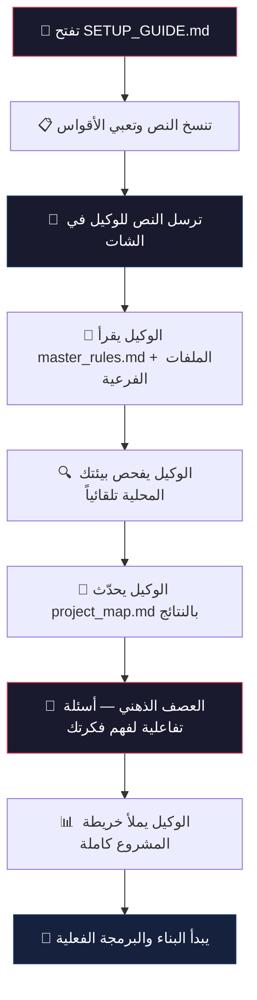

<div dir="rtl">

# 🚀 دليل تشغيل وإقلاع المشاريع الذكية (Antigravity 2.0 Template)

هذا الملف مخصص لك (كمطوّر بشري) لإرشادك بكيفية إطلاق أي مشروع جديد باستخدام هذا القالب دون الحاجة لتهيئة أي مسارات أو إعدادات يدوية.

> ⚠️ **ملاحظة بيئة التشغيل:** هذا القالب مصمم خصيصاً لبيئة **Antigravity 2.0** التي تمنح الوكيل أدوات البحث في الإنترنت، الطرفية (Terminal)، وصلاحيات الملفات. بعض البنود في `master_rules.md` (مثل الفحص البيئي واستيراد المهارات) تعتمد على هذه الأدوات ولن تعمل في بيئات أخرى لا تملكها.

---

## 📌 المتطلبات المسبقة (Prerequisites)

قبل البدء، تأكد من توفر التالي على جهازك:

| المتطلب | الحد الأدنى | ملاحظات |
| :--- | :--- | :--- |
| **Node.js** | v18 أو أحدث | [تحميل من الموقع الرسمي](https://nodejs.org/) |
| **npm أو pnpm** | أحدث إصدار مستقر | يأتي مع Node.js أو يُثبّت بشكل مستقل |
| **Git** | أحدث إصدار | [تحميل من الموقع الرسمي](https://git-scm.com/) |
| **حساب قاعدة بيانات** | — | حساب فعّال على المنصة التي ستختارها (Supabase / Firebase / PlanetScale أو غيرها) |

> 💡 **نصيحة:** شغّل الأوامر التالية في الطرفية للتحقق السريع:
> ```bash
> node -v && npm -v && git --version
> ```

---

## 🛠️ خطوات التشغيل (خاصة بك):

1. قم بنسخ هذا المجلد بالكامل وضعه في مساحة عمل جديدة على جهازك (مع تغيير اسم المجلد إلى الاسم الفعلي لمشروعك الجديد باللغة الإنجليزية لتمييزه وتجنب التكرار).
2. افتح المجلد مباشرة داخل برنامج **Google Antigravity 2.0**.
3. افتح محادثة (شات) جديدة مع الوكيل الذكي.
4. **انسخ النص الموجود في الصندوق أدناه بالكامل**، وضعه في الشات للوكيل.

> ⚠️ **تنبيه مهم قبل الإرسال:** استبدل كل ما بين `[` و `]` بمعلوماتك الخاصة، **واحذف القوسين** معها. لا ترسل الأقواس كما هي.

---

## 📋 انسخ النص أدناه بالكامل وضعه في الشات للوكيل:

"السلام عليكم. أنا مستخدم Vibe Builder، وهذا المجلد يحتوي على ملفات الإدارة الأساسية في الجذر. بما أنك تعمل داخل بيئة Antigravity 2.0 وتملك صلاحيات الملفات والطرفية، نفّذ المهام التالية فوراً وبشكل تلقائي:

1. اقرأ ملف `master_rules.md` من جذر المشروع مباشرة واعتبره الدستور الحاكم الصارم لك في هذا المشروع، والتزم بكل بند فيه (اللغة العربية الفصحى، حماية الـ RLS، منع الكسل، سقف حجم الملفات لـ 200 سطر، تتبّع الهجرات SQL، وحظر فوضى الحزم).
2. اطّلع على الملفات الأخرى (`project_map.md`, `changelog.md`, `bugs_log.md`) لتفهم الهيكلية الحالية للمشروع.
3. استخدم الطرفية والـ Sandbox المدمج لديك لتشغيل الفحص البيئي (Environment Audit) لمعرفة نظام تشغيلي وإصدارات (Node/Python/Git) والمنافذ المتاحة، وسجّل النتائج فوراً في قسم البيئة المحلية بملف `project_map.md`.
4. اسم مشروعي الجديد هو: [اكتب اسم مشروعك هنا]
5. طبيعة المشروع وهويته التقنية هي: [اختر بدقة: تطبيق ويب متجاوب لجميع الشاشات / تطبيق جوال React Native / مشروع باك إند وقاعدة بيانات فقط]
6. الفكرة المبدئية في عقلي هي: [اكتب فكرتك العامة هنا بالتفصيل وبسطرين أو ثلاثة]
7. وضع التشغيل المطلوب هو: [اختر: prototype للتجريب السريع وبناء النموذج الأولي / production للإنتاج الكامل بصرامة جميع القواعد]
8. اسم النداء الخاص بي هو: [اكتب اسم النداء الذي تريد الوكيل يناديك به في كل رد — مثال: يا مدير / يا كابتن / يا باشمهندس — وإذا نسيه يعني فقد السياق]

بعد إنهاء الفحص البيئي وتحديث المستندات، ابدأ العصف الذهني واطرح أسئلتك حبة حبة لتفكيك الـ MVP دون أي تأخير أو كود ناقص."

---

## 🗺️ خريطة الرحلة البصرية — من الإقلاع إلى البرمجة



---

## 💡 بخصوص أمر `/grill-me`:


> **هذا أمر تُشغّله أنت (المستخدم) بنفسك** من واجهة الشات في Antigravity، وليس أمراً يُنفّذه الوكيل. عند كتابة `/grill-me` في صندوق المحادثة، سيبدأ الوكيل بطرح أسئلة تفاعلية عليك واحدة تلو الأخرى لتفكيك فكرتك وتحديد نطاق الـ MVP. يمكنك تشغيله في أي وقت تحتاج فيه لجلسة عصف ذهني منظّمة.

---

## 🔮 ماذا تتوقع بعد الإقلاع؟

بعد إرسال النص أعلاه للوكيل، هذا ما سيحدث بالترتيب:

| الخطوة | ما سيفعله الوكيل | المدة التقريبية |
| :---: | :--- | :---: |
| 1️⃣ | **قراءة الدستور** — يقرأ `master_rules.md` ويلتزم بجميع قواعده | ثوانٍ |
| 2️⃣ | **فحص الملفات** — يطّلع على `project_map.md` و `changelog.md` و `bugs_log.md` | ثوانٍ |
| 3️⃣ | **الفحص البيئي** — يفحص نظام التشغيل، إصدارات Node/Git/Python، والمنافذ المتاحة عبر الطرفية | 1-2 دقيقة |
| 4️⃣ | **تحديث المستندات** — يسجّل نتائج الفحص البيئي في `project_map.md` | ثوانٍ |
| 5️⃣ | **العصف الذهني** — يبدأ بطرح أسئلة تفاعلية لفهم فكرتك بالتفصيل وتحديد نطاق الـ MVP | 5-15 دقيقة (حسب تعقيد المشروع) |
| 6️⃣ | **التخطيط** — يملأ خريطة المشروع (`project_map.md`) بالتقنيات والمراحل والمخاطر | 2-5 دقائق |

> 🎯 **النتيجة النهائية:** ستحصل على خريطة مشروع مكتملة، وبيئة عمل موثّقة، وخطة تنفيذ مرحلية واضحة — كل ذلك قبل كتابة سطر كود واحد.

</div>
