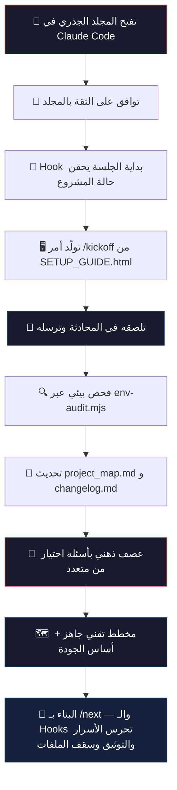
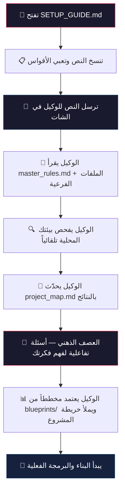

<div dir="rtl">

# 🚀 دليل تشغيل وإقلاع المشاريع الذكية (AG Launchpad AR)

هذا الملف مخصص لك (كمطوّر بشري) لإرشادك بكيفية إطلاق أي مشروع جديد باستخدام هذا القالب دون الحاجة لتهيئة أي مسارات أو إعدادات يدوية. القالب يعمل في أربع بيئات، ولكل بيئة مسارها.

---

## 🧭 اختر بيئتك

| البيئة | لمن تناسب | ابدأ من هنا |
| :--- | :--- | :--- |
| 🟠 **Claude Code** | لديك خطة Claude مدفوعة وتريد إنفاذاً آلياً للقواعد ومراجعة مستقلة ورحلة مبتدئ موجّهة بالكامل | [مسار Claude Code](#claude-code-path) |
| 🟣 **Google Antigravity 2.0** | تستخدم Antigravity أصلاً | [مسار Antigravity 2.0](#antigravity-path) |
| 🖱️ **Cursor** (دعم تجريبي) | تعمل في Cursor وتريد الإنفاذ الآلي نفسه | [مسار Cursor](#cursor-path) |
| 🧩 **OpenCode** (دعم تجريبي) | تريد أداة مفتوحة المصدر تعمل مع نماذج كثيرة منها مجانية، مع الإنفاذ الآلي ونافذة الموافقة | [مسار OpenCode](#opencode-path) |

> 💡 الطريقة الأسهل في كل البيئات: افتح ملف `SETUP_GUIDE.html` بالنقر المزدوج — معالج من 5 خطوات قصيرة: تختار بيئتك، وتجيب عن الأسئلة، وتراجع إجاباتك، ثم تضغط «توليد نص البداية» فيُنتج لك النص الجاهز للنسخ.

---

<a id="download"></a>

## 📦 قبل أي مسار: حمّل القالب وضعه في مكان مشروعك

القالب مجلد ملفات عادي، **وهو نفسه يصير مجلد مشروعك**: الوكيل يبني تطبيقك داخله بجانب ملفات القواعد. لا يُثبَّت شيء، ولا تُنسخ ملفات إلى مكان آخر.

1. في [صفحة المشروع على GitHub](https://github.com/bmubook/ag-launchpad-ar) اضغط الزر الأخضر **Code** ثم **Download ZIP**، فينزل ملف مضغوط واحد.
2. انقل الملف المضغوط إلى المكان الذي تريد أن يكون فيه مشروعك، مثل مجلد «المستندات»، وفك ضغطه هناك (على ويندوز: زر الفأرة الأيمن ثم **Extract All**).
3. غيّر اسم المجلد الناتج إلى اسم مشروعك **بالإنجليزية**، مثل `my-store`.
4. تابع مسار بيئتك أدناه، وافتح فيه هذا المجلد نفسه.

> ⚠️ **مجلد داخل مجلد؟** قد يُنتج فك الضغط مجلداً داخل مجلد بالاسم نفسه. المجلد الصحيح هو الذي ترى فيه مباشرةً ملف `CLAUDE.md`؛ هذا الذي تسمّيه وتفتحه.
>
> 🔁 **مشروع آخر؟** لكل مشروع جديد نسخة جديدة من القالب في مجلد جديد: حمّل وفك الضغط مرة أخرى.

---

<a id="claude-code-path"></a>

## 🟠 مسار Claude Code

### 📌 المتطلبات المسبقة

| المتطلب | الحد الأدنى | ملاحظات |
| :--- | :--- | :--- |
| **خطة Claude مدفوعة** | Pro / Max / Team / Enterprise | الخطة المجانية لا تشمل Claude Code |
| **Claude Code** | تطبيق Claude لسطح المكتب **أو** CLI | التطبيق (مستحسن للمبتدئ): [claude.ai/download](https://claude.ai/download) — الـ CLI: انظر أمر التثبيت أسفل الجدول |
| **Node.js** | v18 أو أحدث — **إلزامي** | تعمل به الـ Hooks وسطر الحالة. [تحميل من الموقع الرسمي](https://nodejs.org/) |
| **Git** | أحدث إصدار | على ويندوز: **Git for Windows إلزامي** لأن الـ Hooks تعمل عبر Git Bash. [تحميل من الموقع الرسمي](https://git-scm.com/) |
| **حساب Firebase** | لاحقاً — ليس مطلوباً عند الإقلاع | حساب Google مجاني يكفي لإنشاء مشروع Firebase على الخطة المجانية (Spark)؛ ستحتاجه عند مرحلة البيانات والمصادقة. بعض الخدمات (Cloud Functions،&rlm; App Hosting، تخزين الملفات) تتطلب خطة Blaze — التفاصيل في `blueprints/README.md` |
| **Firebase CLI + Java** | لاحقاً — عند مرحلة البيانات | Firebase CLI (`npm install -g firebase-tools`) و **JDK 21 أو أحدث** لمحاكيات Firebase من [adoptium.net](https://adoptium.net) — الإصدارات الأقدم يرفضها Firebase CLI، والفحص البيئي ينبّهك تلقائياً |

**تثبيت Claude Code CLI على ويندوز** (في PowerShell — غير مطلوب إذا استخدمت تطبيق سطح المكتب):
```powershell
irm https://claude.ai/install.ps1 | iex
```

> 💡 **نصيحة:** شغّل الأمر التالي في الطرفية للتحقق السريع:
> ```bash
> node -v && git --version
> ```

### 🛠️ خطوات التشغيل

1. ضع مجلد القالب في المكان الذي تريد أن يكون فيه مشروعك، وغيّر اسمه إلى اسم مشروعك **باللغة الإنجليزية** — [كيف أحمّله وأفك ضغطه؟](#download)
2. افتح المجلد **الجذري** للمشروع (المجلد الذي يحوي `CLAUDE.md`) في Claude Code:
   * **تطبيق سطح المكتب:** تبويب **Code** ← اختر المجلد.
   * **الطرفية (CLI):** ادخل المجلد بـ `cd` ثم شغّل `claude`.
   > ⚠️ لا تفتح مجلداً فرعياً داخل المشروع — عندها لا تُحمَّل الإعدادات ولا الـ Hooks ولا المهارات.
3. وافق على نافذة **الثقة بالمجلد (Trust)** عند ظهورها. مجلد `.claude/hooks/` يحوي سكربتات Node صغيرة مقروءة تفرض القواعد آلياً (حماية ملفات `.env`، منع كتابة المفاتيح السرية، نقاط التفتيش، التذكير بالتوثيق). يمكنك فتحها وقراءتها قبل الموافقة. لا توافق على الثقة إلا لمجلدات من مصدر تعرفه.
4. جهّز أمر الإقلاع بإحدى طريقتين:
   * **المولّد (مستحسن):** افتح `SETUP_GUIDE.html` بالنقر المزدوج، أو اطلب من Claude: «افتح لي مولّد الإقلاع». اختر **Claude Code**، وأجب عن أسئلة المعالج (5 خطوات قصيرة مع مراجعة قبل التوليد)، ثم اضغط «نسخ النص».
   * **داخل المحادثة:** اكتب `/kickoff` وحده، فيطرح عليك Claude الأسئلة نفسها داخل الشات.
   * **يدوياً:** انسخ الصندوق أدناه واستبدل الأقواس بمعلوماتك.
5. الصق النص في محادثة Claude Code وأرسله.

> ⚠️ **تنبيه مهم قبل الإرسال:** استبدل كل ما بين `[` و `]` بمعلوماتك الخاصة، **واحذف القوسين** معها. لا ترسل الأقواس كما هي.

### 📋 نص الإقلاع — انسخه والصقه في محادثة Claude Code:

```text
/kickoff
اسم المشروع: [اكتب اسم مشروعك هنا]
طبيعة المشروع: [اختر بدقة: تطبيق ويب متجاوب لجميع الشاشات / تطبيق جوال Flutter و Dart / تطبيق جوال React Native / مشروع باك إند وقاعدة بيانات فقط]
الفكرة المبدئية: [اكتب فكرتك العامة هنا بالتفصيل وبسطرين أو ثلاثة]
وضع التشغيل: [اكتب إحدى الكلمتين: prototype للتجريب السريع بقواعد مخففة / production للإنتاج الكامل بصرامة جميع القواعد]
اسم النداء: [اكتب اسم النداء الذي تريد الوكيل يناديك به في كل رد — مثال: يا مدير / يا كابتن / يا باشمهندس]
مستوى الخبرة: [اختر: مبتدئ تماماً / لدي أساسيات / مطوّر — للمبتدئ يُفعَّل وضع التعلّم]
━━━━━━━━━━━━━━━━━━━━
المستخدم النهائي: [لمشاريع الواجهات فقط — مثال: أصحاب المطاعم الصغيرة من 25-45 سنة]
طابع التصميم: [لمشاريع الواجهات فقط — اختر: احترافي / تجاري / إبداعي / رسمي]
الوضع البصري: [لمشاريع الواجهات فقط — اختر: وضع داكن (Dark Mode) / وضع فاتح (Light Mode)]
اللون الرئيسي المفضل: [اختياري — مثال: بنفسجي #6c63ff]
```

> 🎓 **كيف تختار مستوى خبرتك؟**
> - **مبتدئ تماماً:** لم تكتب كوداً من قبل.
> - **لدي أساسيات:** جرّبت كوداً بسيطاً (دورة أو درس)، ولم تبنِ تطبيقاً كاملاً بعد.
> - **مطوّر:** بنيت تطبيقات من قبل وتفضّل ردوداً مختصرة.
>
> الخياران الأولان يفعّلان وضع التعلّم. إن ترددت فاختر «مبتدئ تماماً».

> 💡 **لمشاريع الباك إند فقط:** احذف الفاصل `━━━` والأسطر الأربعة بعده، واكتب بدلها سطراً واحداً:
> `ملاحظة: المشروع باك إند فقط — لا واجهات مستخدم؛ مُراجع UI/UX معطّل.`
>
> السطر الأول يجب أن يبقى `/kickoff` كما هو، وكل حقل في سطر مستقل.

### 🔮 ماذا يحدث بعد الإرسال؟

| الخطوة | ما يحدث | المدة التقريبية |
| :---: | :--- | :---: |
| 1️⃣ | **تحميل القواعد (منذ فتح الجلسة)** — `CLAUDE.md` يستورد الملفات الحاكمة تلقائياً، و Hook بداية الجلسة يحقن حالة المشروع وآخر السجلات | فوري |
| 2️⃣ | **قراءة بياناتك** — `/kickoff` يقرأ الحقول التي أرسلتها ويتحقق من اكتمالها، ويسألك عن **مستوى خبرتك** (مبتدئ تماماً / لدي أساسيات / مطوّر) إن لم تذكره، فيفعّل **وضع التعلّم** للمستويين الأولين، ويفعّل **اقتراحات التطوير** افتراضياً | أقل من دقيقة |
| 3️⃣ | **الفحص البيئي** — يشغّل `node .claude/scripts/env-audit.mjs` لمعرفة نظام التشغيل وإصدارات الأدوات والمنافذ المتاحة | أقل من دقيقة |
| 4️⃣ | **تحديث المستندات** — يسجّل بياناتك ونتائج الفحص في `project_map.md` ويضيف سطراً في `changelog.md`، 🗺️ وينشئ لك خارطة الطريق `docs/roadmap.html` التي ترى منها أين وصلت ([ما فيها](README.md#roadmap)) | ثوانٍ |
| 5️⃣ | **العصف الذهني** — بعد قراءة ملخص الإقلاع تكتب `1` لبدئه، ثم أسئلة اختيار من متعدد (سؤالان كحد أقصى في كل مرة) لتفكيك فكرتك وتحديد نطاق الـ MVP | 5-15 دقيقة (حسب تعقيد المشروع) |
| 6️⃣ | **التخطيط** — يقترح المخطط التقني المطابق لنوع مشروعك من `blueprints/` (`/blueprint`)، ثم يملأ خريطة المشروع بالتقنيات والمراحل والمخاطر | 2-5 دقائق |

### 🗺️ خريطة الرحلة البصرية — Claude Code


```mermaid
flowchart TD
    A["📂 تفتح المجلد الجذري في Claude Code"] --> B["🔐 توافق على الثقة بالمجلد"]
    B --> C["🧭 Hook بداية الجلسة يحقن حالة المشروع"]
    C --> D["🖥️ تولّد أمر /kickoff من SETUP_GUIDE.html"]
    D --> E["💬 تلصقه في المحادثة وترسله"]
    E --> F["🔍 فحص بيئي عبر env-audit.mjs"]
    F --> G["📝 تحديث project_map.md و changelog.md"]
    G --> H["🧠 عصف ذهني بأسئلة اختيار من متعدد"]
    H --> J["🗺️ مخطط تقني جاهز + أساس الجودة"]
    J --> I["🚀 البناء بـ /next — والـ Hooks تحرس الأسرار والتوثيق وسقف الملفات"]

    style A fill:#1a1a2e,stroke:#d97757,color:#fff
    style E fill:#1a1a2e,stroke:#0f3460,color:#fff
    style H fill:#1a1a2e,stroke:#d97757,color:#fff
    style J fill:#1a1a2e,stroke:#0f3460,color:#fff
    style I fill:#16213e,stroke:#0f3460,color:#fff
```

### 🧭 رحلتك بعد الإقلاع

| # | المحطة | الأمر | ماذا تحصل عليه |
| :---: | :--- | :--- | :--- |
| 1 | الإقلاع | `/kickoff` | بياناتك ومستوى خبرتك وفحص جهازك في `project_map.md` |
| 2 | العصف الذهني | `/grill-me` | نطاق MVP واضح قبل أي كود |
| 3 | المخطط الجاهز | `/blueprint` | حزمة تقنية مجرّبة لنوع مشروعك من `blueprints/` |
| 4 | أساس الجودة | `/quality-setup` | تنسيق وفحص للكود، أول اختبار، وفحص آلي (CI) |
| 5 | البناء تدفقاً تدفقاً | `/next` | مهمة واحدة للمستخدم في كل مرة تنتهي بنتيجة محفوظة (مثل «إنشاء حساب»). يحسم الوكيل «عقدها» في أربع جمل قبل بنائها ويسألك فقط عمّا لا يعرفه، ثم تُقفل 🔒 حين ينجح اختبارها؛ و3 اقتراحات تطوير بعد كل مهمة (على طريقة Lovable) |
| 6 | المتانة | تلقائي + `/health-check` | فحص فعلي بعد كل تعديل، وكشف الاختصارات، وفحص الصحة عند نهاية كل مرحلة — انظر [ماذا تفعل عندما...؟](#when) |
| 7 | الفهم | وضع التعلّم + `/explain` | شرح مبسّط للقرارات والمصطلحات، وقاموس `docs/glossary.md` |
| 8 | الإصلاح | `/fix` | تتبّع السبب الجذري واختبار يمنع عودة الخطأ |
| 9 | الإطلاق الآمن | `/launch-check` | تقرير فحص شامل قبل الإطلاق؛ أي ❌ أمني يوقفه |

> 💡 إذا احترت في أي لحظة فاكتب `/next`.

### 💡 نصائح للمبتدئ في Claude Code

| الأداة | كيف تستخدمها | متى تفيدك |
| :--- | :--- | :--- |
| **وضع التخطيط (Plan mode)** | `Shift+Tab` حتى يظهر وضع Plan (أو محدد الأوضاع في تطبيق سطح المكتب)، أو اكتب `/plan` | قبل أي ميزة كبيرة: يعرض الخطة دون تعديل أي ملف، فتراجعها قبل التنفيذ |
| **الترجيع** | اكتب `/rewind` أو اضغط `Esc` مرتين وصندوق الكتابة فارغ | للتراجع عن تعديلات الجلسة. لا يشمل تعديلات أوامر الطرفية ويضيع بانتهاء الجلسة — **Git هو شبكة الأمان الحقيقية** |
| **`/context`** | اكتبه في أي وقت | لمعرفة مقدار امتلاء ذاكرة المحادثة (السياق) |
| **`/compact`** | اكتبه عند طول المحادثة | يضغط المحادثة. بعده يعيد Hook بداية الجلسة حقن حالة المشروع ويفرض نقطة تفتيش |
| **سطر الحالة** | يظهر في واجهة الطرفية (CLI) أسفل صندوق الكتابة، ولا يظهر في تطبيق سطح المكتب | `🎯 اسم النداء │ 🏭 production أو 🧪 prototype │ ▶ المرحلة │ 🎓 │ النموذج │ 🧠 نسبة امتلاء السياق`. يظهر `🎓` عند تفعيل وضع التعلّم، وإذا ظهر `🚀 /kickoff` فالمشروع لم يُقلع بعد |
| **🧪 سطر الفحص** | آخر كل رد عدّل فيه الوكيل كوداً | `🧪 الفحص: ✅` يعني أن العمل فُحص فعلاً بعد آخر تعديل. في تطبيق سطح المكتب هذا مكان الحالة، وفي أي وقت اكتب `/project-status` |
| **اسم النداء** | راقب أول الرد | إذا غاب من الرد فالوكيل فقد السياق: اكتب `/checkpoint` |
| **🎓 وضع التعلّم** | يُفعَّل تلقائياً للمبتدئ؛ لتغييره اطلب ذلك من الوكيل أو عدّل قيمة `وضع التعلّم` في `project_map.md` | يشرح بعد كل قرار أو تعديل مهم ماذا فعلنا ولماذا، في كتلة `🎓 تعلّم:` قصيرة |
| **💡 الاقتراحات** | تظهر بعد كل مهمة مكتملة: اختر خياراً أو اكتب طلبك | تعرف دائماً خطوتك التالية دون أن تخرج عن نطاق الـ MVP |
| **✂️ ردود قصيرة وبسيطة** | تُفعَّل تلقائياً إذا اخترت «مبتدئ تماماً» أو «لدي أساسيات» | يختصر الوكيل كلامه: الخلاصة أولاً، بلا مصطلحات غير مشروحة، وخياران أو ثلاثة فقط. اكتب **«فصّل»** إذا أردت شرحاً أطول |
| **⚖️ مستوى الخبرة** | تختاره عند الإقلاع، ولتغييره اطلب ذلك من الوكيل | يغيّر طريقة كلام الوكيل فقط: كلمات يومية وأسئلة قصيرة بخيارات جاهزة لغير المبرمج، وصيغة تقنية مختصرة للمطوّر. الحماية والفحص والتدفقات وعقودها واحدة في المستويات الثلاثة |

<a id="when"></a>

### 🆘 ماذا تفعل عندما...؟

| الموقف | ماذا تفعل |
|:---|:---|
| يطلب الوكيل إذنك لتشغيل `verify.mjs` | اختر **«السماح دائماً»**. هذا فحص مشروعك نفسه: يشغّل اختباراته، ولا يحذف شيئاً ولا يرسل شيئاً |
| يتأخر الوكيل بعد كل تعديل | طبيعي: يشغّل الفحص، من 15 ثانية إلى دقيقة ونصف. لا توقفه |
| آخر الرد: `🧪 الفحص: ✅` | العمل فُحص فعلاً بعد آخر تعديل، فتابع |
| آخر الرد: `🔴 الفحص: فاشل`، أو بدأت الجلسة بتنبيه 🔴 | اكتب `/fix` قبل أي ميزة جديدة |
| عدّل الوكيل كوداً وقال «تم» دون سطر `🧪 الفحص` | اكتب: **«شغّل الفحص الآن»**. لا تقبل «تم» بلا فحص |
| ظهر في الرد `🚩 اختصارات مؤقتة` | اسأل: «لماذا هذا الاختصار، ومتى يُزال؟». إن لم يقنعك الجواب فاكتب: «أصلحه الآن» |
| في جدول دليل القبول سطر عليه 👀 | جرّب بنفسك الخطوات المكتوبة فيه؛ هذا ما لا يراه الفحص الآلي، مثل شكل الصفحة |
| انتهت مرحلة من خطة المشروع | اكتب `/health-check` لتعرف صحة المشروع قبل البناء فوقه |
| سألك الوكيل قبل البناء سؤالاً مثل «بعد إرسال الطلب، من يستطيع تعديله؟» | هذا «عقد التدفق»: أربع جمل يحسمها قبل أي كود (من يبدأ، ماذا يُحفظ، من يحق له التغيير، وما المحاولة الخاطئة التي يجب أن تُرفض). اختر من الخيارات أو خذ بسطر `⭐ توصيتي`؛ جوابك يصير اختباراً يحمي هذا الجزء. وإن بدأ الوكيل البناء دون أن يعرض العقد فاكتب: **«ما عقد هذا التدفق؟»** |
| تريد تغيير شيء في جزء مقفل 🔒 من تطبيقك | اطلبه صراحةً، مثل: «غيّر في تدفق إنشاء الحساب كذا». يفتحه الوكيل، يعدّله، ثم يعيد إقفاله بعد نجاح اختباره. وإن عدّل الوكيل جزءاً مقفلاً من نفسه فاسأله: «لماذا فتحت تدفقاً مقفلاً؟» |
| طلب الوكيل موافقتك على أمر ينزّل سكربتاً ويشغّله، أو يرفع ملفاً إلى الإنترنت، أو يعدّل ملفات الحماية | توقّف واقرأ السبب المكتوب. وافق فقط إذا طلبتَ أنت هذا الشيء وتعرف مصدره. وإن لم تطلبه فارفض واكتب: **«لماذا تحاول هذا؟»**؛ قد يكون الوكيل قرأ نصاً مدسوساً في صفحة أو ملف ([ما يمنعه القالب وما لا يمنعه](README.md#injection)) |
| قال الوكيل إن ملف قواعد أو حماية تغيّر بأمر طرفية، وعرض عليك التراجع | هذه طبقة الحماية الاحتياطية: أمر لم يتعرف عليه الحارس مسّ ملفاً حساساً دون أن يسألك. اقرأ ما تغيّر، وإن لم تطلبه أنت فاكتب: **«تراجع عن هذا التغيير»** |
| عرض عليك الوكيل خيارات مرقّمة ولا تعرف أيها تختار | انظر سطر `⭐ توصيتي` تحت الخيارات واقرأ سببه. إن اقتنعت فاكتب رقمه، ولك أن تختار غيره أو تكتب طلبك بكلماتك. وإن غاب السطر فاكتب: **«ما توصيتك ولماذا؟»** |
| تريد معرفة الحالة في أي وقت | اكتب `/project-status` |
| تريد أن ترى أين وصل مشروعك بصرياً | افتح `docs/roadmap.html` بالنقر المزدوج، أو اكتب: **«افتح خارطة الطريق»**. تتحدث وحدها كلما سجّل الوكيل تقدماً |

> 📝 **عن العربية في المحادثة:** واجهات Claude لا تدعم الكتابة من اليمين لليسار أصلياً، فقد يظهر ترتيب الكلمات مختلطاً عند مزج العربية بالإنجليزية. لذلك لا يستخدم الوكيل وسم `<div dir="rtl">` في المحادثة (يظهر نصاً حرفياً)، ويستخدمه فقط داخل ملفات Markdown التي يعرضها GitHub بشكل صحيح.

### ⌨️ الأوامر المتاحة في Claude Code (16 أمراً)

| الأمر | ماذا يفعل |
| :--- | :--- |
| `/kickoff` | إقلاع المشروع لأول مرة (النص أعلاه) |
| `/grill-me` | عصف ذهني بأسئلة اختيار من متعدد — انظر [بخصوص أمر `/grill-me`](#grill-me) |
| `/blueprint` | عرض المخطط التقني المطابق لمشروعك من `blueprints/` واعتماده في `project_map.md` |
| `/quality-setup` | تجهيز المنسّق والفاحص والاختبارات والفحص الآلي (CI) بعد اعتماد التقنيات |
| `/next` | المهمة التالية بالأولوية في بطاقة واضحة بمعايير قبول |
| `/explain` | شرح مصطلح أو ملف أو رسالة خطأ بعربية بسيطة (مثال: `/explain قواعد الأمان`) |
| `/fix` | إصلاح موجّه لخطأ: السبب الجذري، اختبار يمنع عودته، ثم التوثيق |
| `/launch-check` | فحص ما قبل الإطلاق وحفظ التقرير في `docs/launch-report.md` |
| `/env-audit` | الفحص البيئي وتسجيل نتائجه في `project_map.md` |
| `/consensus-gate` | مراجعة التعديل عبر 3 وكلاء مستقلين: الأمن، الأداء، تجربة المستخدم |
| `/document` | التوثيق الإلزامي بعد كل تعديل ناجح + ختم التوثيق |
| `/checkpoint` | نقطة تفتيش يدوية لإعادة تثبيت السياق |
| `/import-skill` | استيراد مهارة خارجية من مصدر رسمي بعد فحصها أمنياً |
| `/health-check` | فحص صحة المشروع عند نهاية كل مرحلة: الاختصارات، الملفات غير المختبرة، ثغرات الحزم، وجولة صيانة مقترحة |
| `/db-change` | تعديل قاعدة البيانات وقواعد الأمان مع اختبارها على المحاكي |
| `/project-status` | لوحة حالة المشروع للقراءة فقط + إشارات النمو |

---

<a id="antigravity-path"></a>

## 🟣 مسار Antigravity 2.0

> ⚠️ **ملاحظة بيئة التشغيل:** هذا المسار لبيئة **Antigravity 2.0** التي تمنح الوكيل أدوات البحث في الإنترنت، الطرفية (Terminal)، وصلاحيات الملفات. بعض البنود في `master_rules.md` (مثل الفحص البيئي واستيراد المهارات) تعتمد على هذه الأدوات ولن تعمل في بيئات أخرى لا تملكها.

### 📌 المتطلبات المسبقة (Prerequisites)

قبل البدء، تأكد من توفر التالي على جهازك:

| المتطلب | الحد الأدنى | ملاحظات |
| :--- | :--- | :--- |
| **Node.js** | v18 أو أحدث | [تحميل من الموقع الرسمي](https://nodejs.org/) |
| **npm أو pnpm** | أحدث إصدار مستقر | يأتي مع Node.js أو يُثبّت بشكل مستقل |
| **Git** | أحدث إصدار | [تحميل من الموقع الرسمي](https://git-scm.com/) |
| **حساب Firebase** | لاحقاً — ليس مطلوباً عند الإقلاع | حساب Google مجاني يكفي لإنشاء مشروع Firebase على الخطة المجانية (Spark)؛ ستحتاجه عند مرحلة البيانات والمصادقة. بعض الخدمات (Cloud Functions،&rlm; App Hosting، تخزين الملفات) تتطلب خطة Blaze — التفاصيل في `blueprints/README.md` |
| **Firebase CLI + Java** | لاحقاً — عند مرحلة البيانات | Firebase CLI (`npm install -g firebase-tools`) و **JDK 21 أو أحدث** لمحاكيات Firebase من [adoptium.net](https://adoptium.net) — الإصدارات الأقدم يرفضها Firebase CLI، والفحص البيئي ينبّهك تلقائياً |

> 💡 **نصيحة:** شغّل الأوامر التالية في الطرفية للتحقق السريع:
> ```bash
> node -v && npm -v && git --version
> ```

### 🛠️ خطوات التشغيل (خاصة بك):

1. ضع مجلد القالب في المكان الذي تريد أن يكون فيه مشروعك، وغيّر اسمه إلى اسم مشروعك **باللغة الإنجليزية** — [كيف أحمّله وأفك ضغطه؟](#download)
2. افتح المجلد مباشرة داخل برنامج **Google Antigravity 2.0**.
3. افتح محادثة (شات) جديدة مع الوكيل الذكي.
4. **انسخ النص الموجود في الصندوق أدناه بالكامل**، وضعه في الشات للوكيل.

> ⚠️ **تنبيه مهم قبل الإرسال:** استبدل كل ما بين `[` و `]` بمعلوماتك الخاصة، **واحذف القوسين** معها. لا ترسل الأقواس كما هي.

### 📋 انسخ النص أدناه بالكامل وضعه في الشات للوكيل:

"السلام عليكم. أنا مستخدم Vibe Builder، وهذا المجلد يحتوي على ملفات الإدارة الأساسية في الجذر. بما أنك تعمل داخل بيئة Antigravity 2.0 وتملك صلاحيات الملفات والطرفية، نفّذ المهام التالية فوراً وبشكل تلقائي:

1. اقرأ جميع الملفات الحاكمة التسعة والتزم ببروتوكول بداية الجلسة (Session Start Protocol) حسب الترتيب الإجباري: `master_rules.md`،&rlm; `rules_security.md`،&rlm; `rules_code_quality.md`،&rlm; `rules_workflow.md`،&rlm; `rules_ui.md`،&rlm; `project_map.md`، وآخر 5 مدخلات في `changelog.md`، والأخطاء النشطة في `bugs_log.md`، وآخر 5 قرارات في `decisions_log.md` بالإضافة إلى `.agents/AGENTS.md` واعتبرها الدستور الحاكم الصارم لك.
2. تأكد من استيعاب كافة القواعد والقوانين الحاكمة (اللغة العربية الفصحى، حماية قواعد الأمان في Firebase، منع الكسل، سقف حجم الملفات حسب نوعها (البند 14)، تتبّع الهجرات SQL، وحظر فوضى الحزم).
3. استخدم الطرفية والـ Sandbox المدمج لديك لتشغيل الفحص البيئي (Environment Audit) لمعرفة نظام تشغيلي وإصدارات (Node/Python/Git) والمنافذ المتاحة، وسجّل النتائج فوراً في قسم البيئة المحلية بملف `project_map.md`.
4. اسم مشروعي الجديد هو: [اكتب اسم مشروعك هنا]
5. طبيعة المشروع وهويته التقنية هي: [اختر بدقة: تطبيق ويب متجاوب لجميع الشاشات / تطبيق جوال Flutter و Dart / تطبيق جوال React Native / مشروع باك إند وقاعدة بيانات فقط]
6. الفكرة المبدئية في عقلي هي: [اكتب فكرتك العامة هنا بالتفصيل وبسطرين أو ثلاثة]
7. وضع التشغيل المطلوب هو: [اختر: prototype للتجريب السريع وبناء النموذج الأولي / production للإنتاج الكامل بصرامة جميع القواعد]
8. اسم النداء الخاص بي هو: [اكتب اسم النداء الذي تريد الوكيل يناديك به في كل رد — مثال: يا مدير / يا كابتن / يا باشمهندس — وإذا نسيه يعني فقد السياق]
9. مستوى خبرتي البرمجية: [اختر: مبتدئ تماماً / لدي أساسيات / مطوّر — إذا لم تكن مطوّراً فأضف: فعّل وضع التعلّم واشرح كل قرار مهم بسطرين بلغة بسيطة]

بعد إنهاء الفحص البيئي وتحديث المستندات، شغّل في الطرفية `node .claude/scripts/roadmap.mjs` لإنشاء خارطة الطريق `docs/roadmap.html` وأخبرني أنني أفتحها بالنقر المزدوج لأرى أين وصلنا، ثم ابدأ العصف الذهني واطرح أسئلتك حبة حبة لتفكيك الـ MVP دون أي تأخير أو كود ناقص. وأثناء العصف الذهني اقرأ المخطط التقني المطابق لطبيعة مشروعي من مجلد `blueprints/` (`web.md` أو `flutter.md` أو `react-native.md` أو `backend.md`)، واعتمده أساساً لاقتراح الحزمة التقنية وهيكل المجلدات وخط الأساس الأمني وخط أساس الجودة والمراحل بعد إعلاني انتهاء العصف الذهني، وتحقق من الإصدارات في التوثيق الرسمي قبل أي تثبيت."

### 🗺️ خريطة الرحلة البصرية — من الإقلاع إلى البرمجة


```mermaid
flowchart TD
    A["📄 تفتح SETUP_GUIDE.md"] --> B["📋 تنسخ النص وتعبي الأقواس"]
    B --> C["💬 ترسل النص للوكيل في الشات"]
    C --> D["📖 الوكيل يقرأ master_rules.md + الملفات الفرعية"]
    D --> E["🔍 الوكيل يفحص بيئتك المحلية تلقائياً"]
    E --> F["📝 الوكيل يحدّث project_map.md بالنتائج"]
    F --> G["🧠 العصف الذهني — أسئلة تفاعلية لفهم فكرتك"]
    G --> H["📊 الوكيل يعتمد مخططاً من blueprints/ ويملأ خريطة المشروع"]
    H --> I["🚀 يبدأ البناء والبرمجة الفعلية"]

    style A fill:#1a1a2e,stroke:#e94560,color:#fff
    style C fill:#1a1a2e,stroke:#0f3460,color:#fff
    style G fill:#1a1a2e,stroke:#e94560,color:#fff
    style I fill:#16213e,stroke:#0f3460,color:#fff
```

### 🔮 ماذا تتوقع بعد الإقلاع؟

بعد إرسال النص أعلاه للوكيل، هذا ما سيحدث بالترتيب:

| الخطوة | ما سيفعله الوكيل | المدة التقريبية |
| :---: | :--- | :---: |
| 1️⃣ | **قراءة الدستور** — يقرأ `master_rules.md` ويلتزم بجميع قواعده | ثوانٍ |
| 2️⃣ | **فحص الملفات** — يطّلع على `project_map.md` و `changelog.md` و `bugs_log.md` | ثوانٍ |
| 3️⃣ | **الفحص البيئي** — يفحص نظام التشغيل، إصدارات Node/Git/Python، والمنافذ المتاحة عبر الطرفية | 1-2 دقيقة |
| 4️⃣ | **تحديث المستندات** — يسجّل نتائج الفحص البيئي في `project_map.md`، 🗺️ وينشئ لك خارطة الطريق `docs/roadmap.html` التي ترى منها أين وصلت ([ما فيها](README.md#roadmap)) | ثوانٍ |
| 5️⃣ | **العصف الذهني** — يبدأ بطرح أسئلة تفاعلية لفهم فكرتك بالتفصيل وتحديد نطاق الـ MVP، ويقرأ المخطط التقني المطابق لنوع مشروعك من `blueprints/` | 5-15 دقيقة (حسب تعقيد المشروع) |
| 6️⃣ | **التخطيط** — يقترح الحزمة التقنية من المخطط، ثم يملأ خريطة المشروع (`project_map.md`) بالتقنيات والمراحل والمخاطر | 2-5 دقائق |

> ⭐ **حين يعرض عليك الوكيل خيارات:** ستجد تحتها سطر `⭐ توصيتي` مع سببه. إن اقتنعت فاختر الموصى به، ولك أن تختار غيره أو تكتب طلبك بكلماتك. وإن غاب السطر فاكتب: «ما توصيتك ولماذا؟»

### 📚 موارد مشتركة تفيدك في Antigravity

| المورد | ما فيه | كيف تستفيد منه |
| :--- | :--- | :--- |
| `blueprints/` | 4 مخططات تقنية جاهزة (ويب، Flutter،&rlm; React Native، باك إند): الحزمة التقنية، هيكل المجلدات، خط الأساس الأمني، خط أساس الجودة، النشر، أخطاء المبتدئين الشائعة، المراحل المقترحة | ابدأ بـ `blueprints/README.md` لتعرف أي مخطط يناسبك، واطلب من الوكيل اعتماده |
| `docs/glossary.md` | قاموس المصطلحات التقنية بشرح مبسّط ومثال | اقرأه عند أي مصطلح غامض، واطلب من الوكيل إضافة المصطلحات الجديدة إليه |

> 📝 الأوامر `/next` و `/explain` و `/fix` و `/launch-check` ووضع التعلّم والاقتراحات بعد كل مهمة خاصة بـ Claude Code. في Antigravity اطلب الإجراء المقابل من الوكيل بكلماتك (مثال: "ما المهمة التالية؟" أو "افحص المشروع قبل الإطلاق").

---

<a id="cursor-path"></a>

## 🖱️ مسار Cursor (دعم تجريبي)

> جُرّب على Cursor 3.12 في ويندوز. طبقة الحماية نفسها التي في Claude Code تعمل هنا تلقائياً: تمنع قراءة ملف الأسرار، وتنبّه إلى الملفات المتضخمة والاختصارات، وتعيد الوكيل ليفحص عمله ويوثّقه قبل أن ينهي رده.

### 📌 المتطلبات المسبقة

| المتطلب | لماذا |
| :--- | :--- |
| **Cursor باشتراك يتيح وضع Agent** | التجربة المجانية محدودة؛ عند انتهائها يتوقف الوكيل عن تنفيذ طلباتك حتى تجدّد |
| &rlm;**Node.js 18 أو أحدث** — إلزامي | طبقة الحماية تعمل به. للتحقق اكتب في الطرفية: `node --version` |
| &rlm;**Git** — مستحسن | شبكة الأمان للتراجع عن أي تعديل |

### 🛠️ خطوات التشغيل

1. ضع مجلد القالب في مكان مشروعك وسمِّه باسمه بالإنجليزية ([كيف أحمّله وأفك ضغطه؟](#download))، ثم افتح مجلد المشروع **الجذري** في Cursor ووافق على «الثقة بالمجلد».
2. افتح `SETUP_GUIDE.html` بالنقر المزدوج، واختر **Cursor**، وأجب عن الأسئلة، ثم اضغط «توليد نص البداية».
3. افتح محادثة جديدة مع الوكيل في وضع **Agent** والصق النص.

### 🔮 ماذا يحدث بعد الإرسال؟

| الخطوة | ما يحدث |
| :---: | :--- |
| 1️⃣ | **ملخص الحالة** — يصل الوكيلَ مع رسالتك ملخص يبدأ بـ `🧭`، ومعه أمر بقراءة ملفات القواعد قبل أي عمل |
| 2️⃣ | **قراءة بياناتك** — يقرأ ملف الإقلاع والحقول التي أرسلتها، ويسألك عما ينقص بخيارات مرقّمة تختار منها برقم |
| 3️⃣ | **الفحص البيئي** — يشغّل أمراً يتعرّف به على جهازك. إن طلب Cursor إذنك لتشغيل الأمر فوافق |
| 4️⃣ | **تحديث المستندات** — يسجّل بياناتك في `project_map.md` وسطراً في `changelog.md`، 🗺️ وينشئ لك خارطة الطريق `docs/roadmap.html` التي ترى منها أين وصلت ([ما فيها](README.md#roadmap)) |
| 5️⃣ | **العصف الذهني ثم المخطط التقني** — كما في رحلة Claude Code أعلاه، مع فرق واحد: تكتب «نفّذ next» بدل `/next` |

### 📋 أو اكتب نص الإقلاع يدوياً

انسخ نص الإقلاع من [مسار Claude Code](#claude-code-path) واستبدل سطره الأول `/kickoff` بهذا السطر:

```text
نفّذ أمر kickoff: اقرأ الملف .claude/skills/kickoff/SKILL.md ونفّذه كاملاً بالبيانات التالية:
```

### 🔀 ما يختلف عن Claude Code

| في Claude Code | في Cursor |
| :--- | :--- |
| تكتب `/next` | تكتب «نفّذ next»، وكذلك بقية الأوامر الـ 16 |
| نافذة تطلب موافقتك قبل الإجراء الحساس | الإجراء المشكوك في أمانه يُمنع مباشرة، ويشرح لك الوكيل السبب |
| سطر حالة أسفل الطرفية | تسأل الوكيل عن حالة الفحص |
| 3 وكلاء مراجعة مستقلون | الوكيل يتقمّص المراجعين الثلاثة |

<a id="cursor-when"></a>

### 🆘 ماذا تفعل عندما...؟ (في Cursor)

| الموقف | ماذا تفعل |
|:---|:---|
| رفض الوكيل قراءة ملف أو كتابة سطر أو تشغيل أمر، وقال إن الإجراء مُنع | هذا حارس القالب يعمل: يمنع قراءة `.env` ومخازن المفاتيح وكتابة المفاتيح داخل الكود، ويمنع تنزيل سكربت وتشغيله، ورفع ملف إلى الإنترنت، وتعديل ملفات الحماية. لا تطلب من الوكيل الالتفاف عليه. إن كنت أنت من يريد الإجراء فنفّذه بيدك، مثل كتابة المفتاح في ملف `.env` بنفسك. وإن لم تطلبه فاسأل الوكيل: «لماذا حاولت هذا؟» |
| أنهى الوكيل رده ثم أكمل من تلقاء نفسه ليفحص أو يوثّق | طبيعي: بوابة إنهاء الرد أعادته ليفحص عمله ويسجّله. تحدث مرة واحدة في كل طلب، فانتظر حتى ينتهي |
| كتبت `/next` فلم يتعرف Cursor على الأمر | اكتب الاسم بكلمات: **«نفّذ next»**. يسري ذلك على الأوامر الـ 16 كلها |
| تريد معرفة حالة الفحص | انظر سطر `🧪 الفحص` في آخر رد عدّل فيه الوكيل كوداً، أو اكتب: **«ما حالة الفحص؟»** |
| قال الوكيل إنه عدّل ملفاً من ملفات القواعد 🛡️ | اسأله: «ماذا غيّرت فيه ولماذا؟». إن لم تطلب أنت هذا التعديل فاكتب: «تراجع عن هذا التعديل» |
| لم يذكر الوكيل ملخص `🧭` ولم يلتزم بالقواعد | تأكد أنك فتحت المجلد **الجذري**، وأن `node --version` يعطي 18 أو أحدث، ثم افتح محادثة جديدة |
| توقف الوكيل وطلب Cursor الترقية | انتهت حصة خطتك في Cursor. ملفات مشروعك وسجلاته محفوظة على جهازك، فتكمل من حيث توقفت بعد التجديد، أو تفتح المجلد نفسه في Claude Code |

> 📌 بقية الحالات (`🔴 الفحص: فاشل`، `🚩` اختصار، «تم» بلا فحص، سطر `⭐ توصيتي`...) في [الجدول العام](#when)، وتسري هنا كما هي مع كتابة «نفّذ fix» بدل `/fix`.

---

<a id="opencode-path"></a>

## 🧩 مسار OpenCode (دعم تجريبي)

> جُرّب على تطبيق OpenCode 2.0 لسطح المكتب في ويندوز. طبقة الحماية نفسها التي في Claude Code تعمل هنا تلقائياً عبر إضافة صغيرة في القالب: تمنع قراءة ملف الأسرار، وتطلب موافقتك قبل الإجراء الحساس، وتنبّه إلى الملفات المتضخمة والاختصارات، وتعيد الوكيل ليفحص عمله ويوثّقه قبل أن ينهي رده.

### 📌 المتطلبات المسبقة

| المتطلب | لماذا |
| :--- | :--- |
| **OpenCode 2 أو أحدث** (تطبيق سطح المكتب أو الطرفية) | من [opencode.ai](https://opencode.ai). الإصدار 1 القديم لا يشغّل إضافة القالب، فيعمل الوكيل فيه بالقواعد المكتوبة فقط |
| **نموذج ذكاء اصطناعي** | تختاره من قائمة النماذج في OpenCode، وفيها نماذج مجانية. المجانية تكفي للبداية، والأقوى أنسب للمشاريع الطويلة |
| &rlm;**Node.js 18 أو أحدث** — إلزامي | طبقة الحماية تعمل به. للتحقق اكتب في الطرفية: `node --version` |
| &rlm;**Git** — مستحسن | شبكة الأمان للتراجع عن أي تعديل |

### 🛠️ خطوات التشغيل

1. ضع مجلد القالب في مكان مشروعك وسمِّه باسمه بالإنجليزية ([كيف أحمّله وأفك ضغطه؟](#download))، ثم افتح مجلد المشروع **الجذري** في OpenCode (المجلد الذي ترى فيه `AGENTS.md`). في الطرفية: ادخل المجلد ثم اكتب `opencode`.
2. افتح `SETUP_GUIDE.html` بالنقر المزدوج، واختر **OpenCode**، وأجب عن الأسئلة، ثم اضغط «توليد نص البداية».
3. ابدأ جلسة جديدة في OpenCode والصق النص.

### 🔮 ماذا يحدث بعد الإرسال؟

| الخطوة | ما يحدث |
| :---: | :--- |
| 1️⃣ | **القواعد وملخص الحالة** — تضعها إضافة القالب في ذاكرة الوكيل تلقائياً مع كل رسالة، فلا تظهر لك في المحادثة ولا يحتاج الوكيل إلى قراءتها |
| 2️⃣ | **قراءة بياناتك** — يقرأ الحقول التي أرسلتها، ويسألك عما ينقص بخيارات مرقّمة تختار منها برقم |
| 3️⃣ | **الفحص البيئي** — يشغّل أمراً يتعرّف به على جهازك. إن طلب OpenCode إذنك لتشغيل الأمر فوافق |
| 4️⃣ | **تحديث المستندات** — يسجّل بياناتك في `project_map.md` وسطراً في `changelog.md`، 🗺️ وينشئ لك خارطة الطريق `docs/roadmap.html` التي ترى منها أين وصلت ([ما فيها](README.md#roadmap)) |
| 5️⃣ | **العصف الذهني ثم المخطط التقني** — كما في رحلة Claude Code أعلاه، والأوامر هي نفسها: اكتب `/` واختر من القائمة |

### 📋 أو اكتب نص الإقلاع يدوياً

انسخ نص الإقلاع من [مسار Claude Code](#claude-code-path) واستبدل سطره الأول `/kickoff` بهذا السطر:

```text
نفّذ أمر kickoff: حمّل المهارة kickoff بأداة skill ونفّذها كاملةً بالبيانات التالية:
```

### 🔀 ما يختلف عن Claude Code

| في Claude Code | في OpenCode |
| :--- | :--- |
| تكتب `/next` | مثله: الأوامر الـ 16 في قائمة `/` |
| نافذة تطلب موافقتك قبل الإجراء الحساس | مثله: نافذة OpenCode نفسها، وفيها سبب الطلب بالعربية |
| يعود الوكيل ليفحص عمله ويوثّقه قبل إنهاء الرد | مثله، وتظهر قبلها في المحادثة رسالة تبدأ بـ «⚙️ رسالة آلية من حماية القالب» |
| 3 وكلاء مراجعة مستقلون | مثله |
| سطر حالة أسفل الطرفية | غير موجود: تسأل الوكيل عن حالة الفحص |

<a id="opencode-when"></a>

### 🆘 ماذا تفعل عندما...؟ (في OpenCode)

| الموقف | ماذا تفعل |
|:---|:---|
| ظهرت في المحادثة رسالة تبدأ بـ «⚙️ رسالة آلية من حماية القالب» | طبيعي: أنهى الوكيل رده قبل أن يفحص عمله أو يوثّقه، فأعادته الحماية ليكمل. لا تحتاج رداً منك، وتحدث مرة واحدة في كل طلب، فانتظر حتى ينتهي |
| ظهرت نافذة تطلب موافقتك وفيها سبب يبدأ بـ 🛡️ أو 🔒 | اقرأ السبب. وافق إن كان ما يفعله الوكيل هو ما طلبتَه أنت، مثل تعديل ملف قواعد طلبت تعديله. وإن لم تطلبه فارفض واكتب: **«لماذا تحاول هذا؟»**؛ قد يكون الوكيل قرأ نصاً مدسوساً في صفحة أو ملف |
| رفض الوكيل قراءة ملف أو كتابة سطر، وقال إن الإجراء مُنع | هذا حارس القالب يعمل: يمنع قراءة `.env` ومخازن المفاتيح وكتابة المفاتيح داخل الكود. لا تطلب من الوكيل الالتفاف عليه. إن كنت أنت من يريد الإجراء فنفّذه بيدك، مثل كتابة المفتاح في ملف `.env` بنفسك |
| كتبت `/` فلم تجد أوامر القالب (`next` و `fix` وغيرهما) | تأكد أنك فتحت المجلد **الجذري**، ثم ابدأ جلسة جديدة. ولك دائماً أن تكتب الاسم بكلمات: «نفّذ next» |
| لم يلتزم الوكيل بالقواعد، مثل أن ينسى اسم النداء | تأكد من فتح المجلد **الجذري**، وأن `node --version` يعطي 18 أو أحدث، وأن إصدار OpenCode هو 2 أو أحدث، ثم ابدأ جلسة جديدة |
| قال الوكيل إن إضافة القالب لم تجد Node.js | يحدث غالباً على الماك حين يكون Node مثبّتاً بطريقة لا يراها التطبيق. ثبّت Node.js من [nodejs.org](https://nodejs.org) (زر التحميل الأول)، ثم أغلق OpenCode وافتحه من جديد |
| يتعثر الوكيل في المهام الطويلة أو يكرر الأخطاء | النماذج المجانية أضعف في العمل الطويل. اختر نموذجاً أقوى من قائمة النماذج، وتبقى ملفات مشروعك وسجلاته كما هي |
| تريد معرفة حالة الفحص | انظر سطر `🧪 الفحص` في آخر رد عدّل فيه الوكيل كوداً، أو اكتب: **«ما حالة الفحص؟»** |

> 📌 بقية الحالات (`🔴 الفحص: فاشل`، `🚩` اختصار، «تم» بلا فحص، سطر `⭐ توصيتي`...) في [الجدول العام](#when)، وتسري هنا كما هي بالأوامر نفسها.

---

<a id="grill-me"></a>

## 💡 بخصوص أمر `/grill-me` (في كل البيئات)

> **هذا أمر تُشغّله أنت (المستخدم) بنفسك** في صندوق المحادثة، وليس أمراً يُنفّذه الوكيل من تلقاء نفسه. يمكنك تشغيله في أي وقت تحتاج فيه لجلسة عصف ذهني منظّمة لتفكيك فكرتك وتحديد نطاق الـ MVP أو تفاصيل ميزة جديدة.

| البيئة | مصدر الأمر | كيف يعمل |
| :--- | :--- | :--- |
| 🟠 **Claude Code** | مهارة مدمجة في القالب (`.claude/skills/grill-me/`) | اكتب `/grill-me` ويمكنك إضافة الموضوع بعده (مثال: `/grill-me نظام الحجز`). يطرح الوكيل أسئلة اختيار من متعدد بحد أقصى سؤالين في كل مرة، ومع كل سؤال خيار "Other" لكتابة إجابتك بحرية. بعد إعلانك انتهاء العصف الذهني يقترح المخطط التقني (`/blueprint`) ثم يجهّز أساس الجودة (`/quality-setup`) |
| 🟣 **Antigravity 2.0** | أمر من واجهة الشات في Antigravity | اكتب `/grill-me` فيبدأ الوكيل بطرح أسئلة تفاعلية عليك واحدة تلو الأخرى، ويعتمد المخطط المطابق من `blueprints/` عند اختيار التقنيات |
| 🖱️ **Cursor** | المهارة نفسها (`.claude/skills/grill-me/`) | اكتب «نفّذ grill-me» ويمكنك إضافة الموضوع بعده. تأتي الأسئلة بخيارات مرقّمة تجيب عنها بكتابة الرقم |
| 🧩 **OpenCode** | المهارة نفسها، والأمر في قائمة `/` | اكتب `/grill-me` واختره من القائمة، ويمكنك إضافة الموضوع بعده. تأتي الأسئلة بخيارات مرقّمة تجيب عنها بكتابة الرقم |

---

> 🎯 **النتيجة النهائية (في كل البيئات):** ستحصل على خريطة مشروع مكتملة، وبيئة عمل موثّقة، ومخطط تقني مجرّب، وخطة تنفيذ مرحلية واضحة — كل ذلك قبل كتابة سطر كود واحد.

</div>
